# HyperQuote

**The connected workspace for building-materials procurement.**

From the first material list to the final delivery, HyperQuote brings customers,
sales teams, operations, and drivers into one coordinated workflow. Built for
Egypt’s construction industry, it keeps quotations, stock, payments, and site
deliveries moving together.

[Explore HyperQuote](https://www.hyperquote.net) ·
[Customer portal](https://portal.hyperquote.net) ·
[Internal workspace](https://internal.hyperquote.net) ·
[Driver app](https://driver.hyperquote.net)

##  Find the right materials

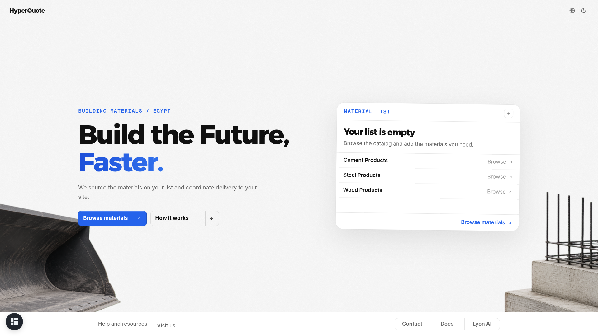

Browse the material catalog, search by product and specification, and build a
list around your project. Start before signing in, then save your list or submit
it as a quote request with your quantities and delivery details.

**One customer account connects the website and portal.** Your work follows you
from discovery to order management.

Explore the catalog and search experience

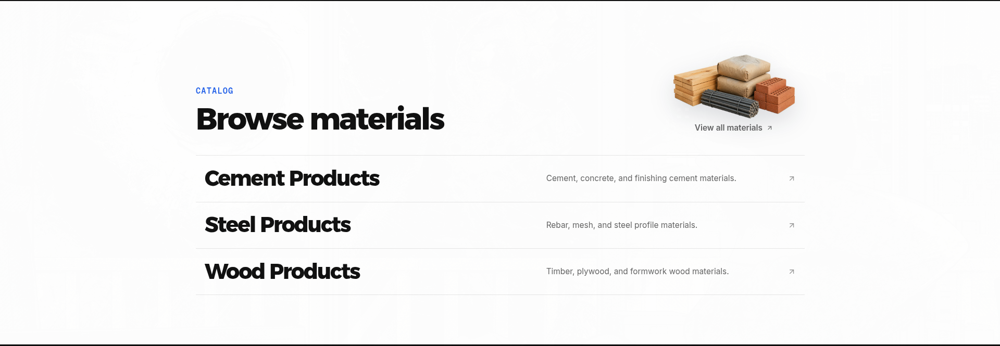
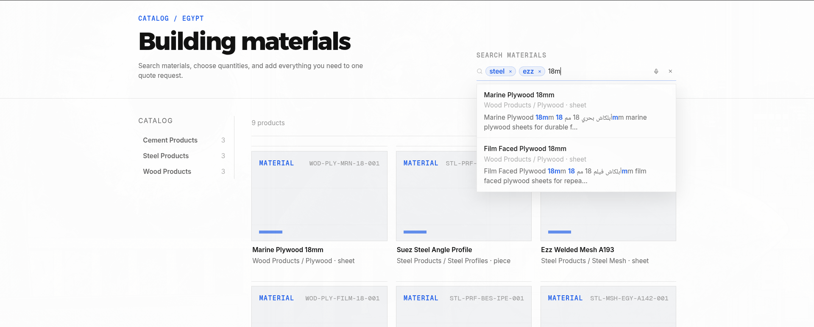

##  Keep every request in view

Prepare and save drafts, submit quote requests, review order details, and follow
delivery updates from your customer workspace. Turn a previous order into a new
editable draft without changing the original.

**Lyon, your planning assistant**, helps you find products, shape a material
list, and edit your cart in plain language. AI-generated estimates remain
editable starting points—not engineering specifications or purchasing decisions.

See Lyon turn a request into a working draft

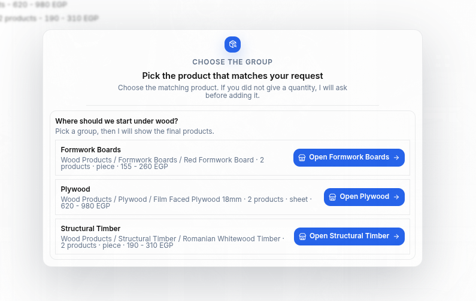
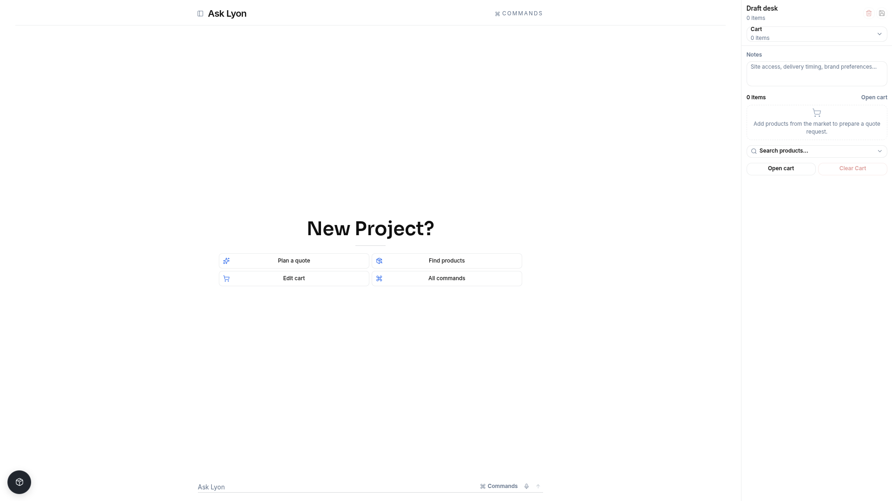
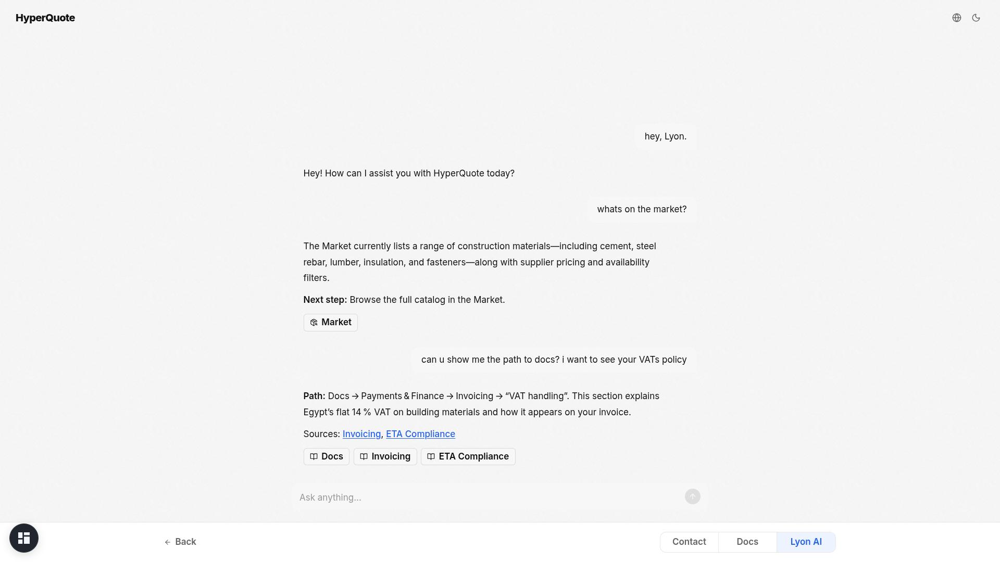

Website Lyon explains public information and guides visitors. Account-specific
planning and actions belong in the signed-in portal.

##  Give every team a connected workspace

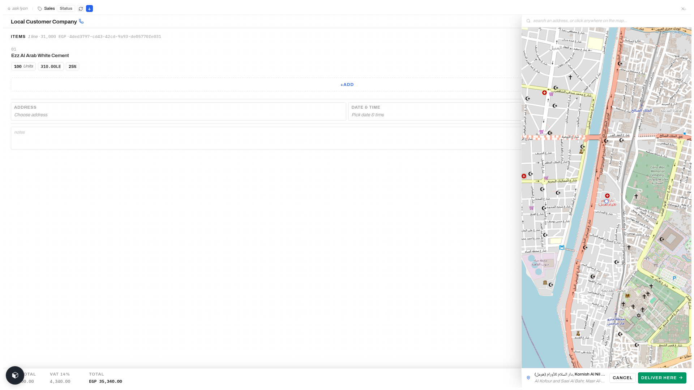

A customer request becomes a coordinated operation, with a workspace for each team.

- **Sales** — refine quantities, pricing, and delivery details; preserve quote revisions and customer notes.
- **Inventory** — manage products, supplier records, stock, and reservations.
- **Finance** — review payments and approvals before orders move forward.
- **Warehouse & dispatch** — prepare handoffs and coordinate driver assignments.
- **Customer service & management** — handle support, search operational records, and follow activity.

Role-based access keeps responsibilities clear. Recorded changes and controlled
handoffs give teams a shared history instead of disconnected updates.

Internal home, inventory, finance, and management views

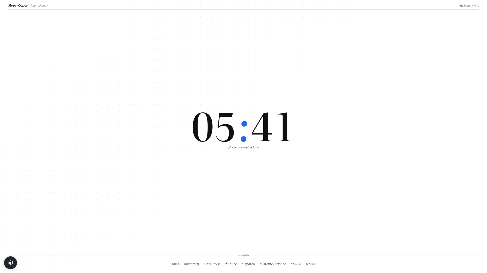

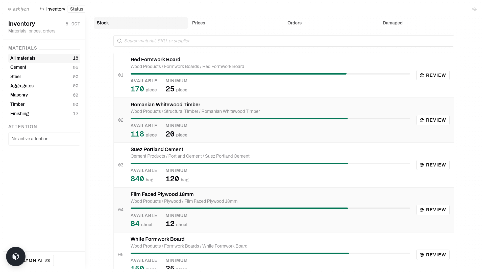
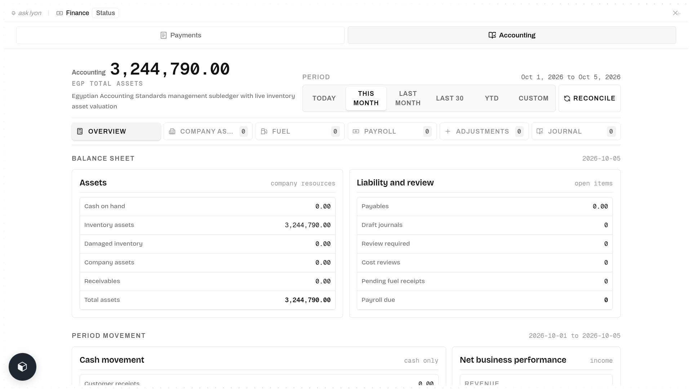
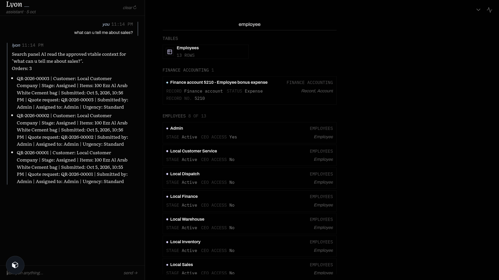

##  Carry the workflow to the site

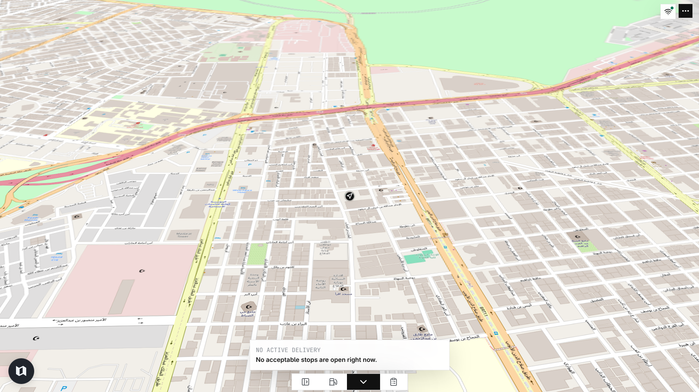

Drivers have a dedicated, map-first experience for delivery assignments,
destinations, progress, and completion. Delivery verification connects the site
handoff back to the operational record.

The view above shows a driver awaiting an active delivery. Live assignments,
tracking, and delivery actions require a network connection.

## One request. One connected journey.

**Choose materials → request a quote → confirm → approve payment → prepare → dispatch → deliver.**

Customers follow their own requests while each team works on the same underlying
operation. Access is scoped to the account and role, and critical transitions
are validated before the order moves to the next stage.

## Designed for the way your team works

**English & Arabic** on customer and driver surfaces. **Light & dark themes**.
**Installable apps**. Integrated help and product documentation.
Context-aware Lyon assistance respects the information available to each user.

Product documentation

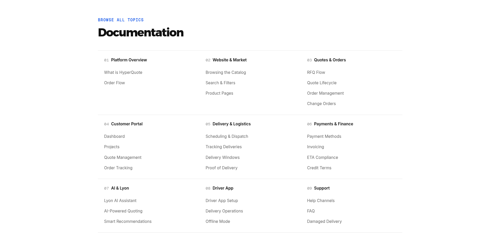
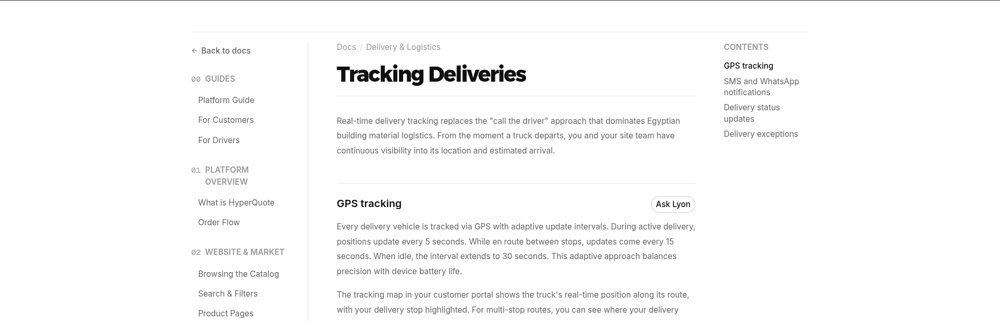

Behind the workflow — the connected database

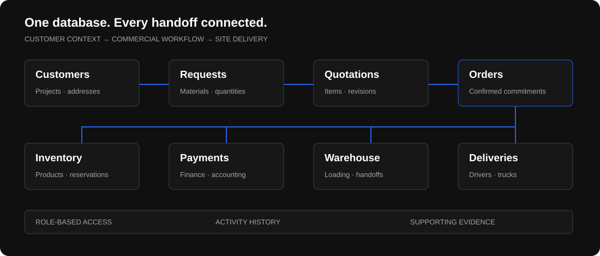

One shared database keeps customer requests, quotations, stock reservations,
payments, and deliveries connected. Each handoff retains its context, so teams
can trace an order from the original request to its delivery record.

[Explore the database design](docs/DATABASE.md) — relationships, workflow
integrity, and access boundaries, without exposing live customer records.

## Experience HyperQuote

| Experience | Open |
| --- | --- |
| Discover materials | [Website](https://www.hyperquote.net) |
| Plan and follow orders | [Customer portal](https://portal.hyperquote.net) |
| Explore the operation | [Internal workspace](https://internal.hyperquote.net) |
| Follow the delivery journey | [Driver app](https://driver.hyperquote.net) |

Open the floating app switcher, then **Info**, for demonstration accounts and
walkthrough tips. The public showcase uses fictional data and shared accounts;
please do not enter personal information or place real orders. AI, email, and
phone features depend on their connected services.

---

Designed and developed by **[Abdulrahman M. Yaqyn](https://yaqyn.dev)**.
