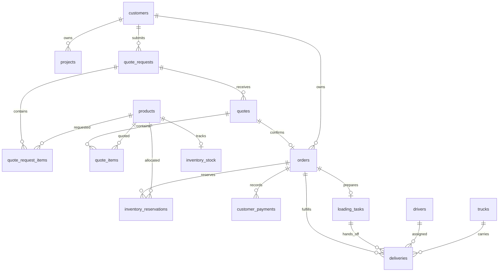

# HyperQuote database

**One operational record, from material request to delivery.**

HyperQuote’s Supabase Postgres database connects the four applications through
shared business records. Customers see their own requests and orders; employees
and drivers receive the information appropriate to their responsibilities.

## What stays connected

| Area | What it preserves |
| --- | --- |
| Customers & projects | Account ownership, site context, and delivery addresses. |
| Materials | Category, family, type, and product relationships. |
| Requests & quotations | Requested items, sales quotations, and quote versions. |
| Orders & inventory | Confirmed orders, available stock, and reserved quantities. |
| Finance | Recorded customer payments and accounting journal records. |
| Warehouse & delivery | Loading tasks, assigned drivers, trucks, and delivery records. |
| History & evidence | Actor-linked activity and supporting proof documents. |

## Core relationships

This is a selected view of actual foreign-key relationships, not the full schema.
Cardinality describes the records the schema allows; workflow rules determine
when an order is ready to advance. Optional links are omitted for readability.

## Integrity through every handoff

- **Preserved requests** — sales edits and quote versions retain the original customer submission.
- **Controlled transitions** — critical actions use transactional database operations, not UI-only checks.
- **Stock accountability** — reservations connect an order to its allocated products.
- **Traceable activity** — append-only history identifies the actor behind business changes.
- **Supporting evidence** — proof-document records connect operational evidence to the platform’s history.

## Access boundaries

The browser uses Supabase directly for authentication only. Business reads and
writes pass through application server functions or API handlers that enforce
account ownership, employee roles, and driver assignment boundaries.
Public business tables and privileged operations are not opened directly to
browser clients. Supabase Storage holds supporting files behind the relevant
access controls.

## Inspect the design

- [Versioned schema migrations](../supabase/migrations/) — the schema’s source of truth.
- [Generated database types](../packages/types/src/database.types.ts) — tables, fields, and relationships.
- [Business workflow contracts](../BACKEND_FLOW.md) — application and server responsibilities.
- [API-boundary verification](../scripts/assert-supabase-api-boundary.mjs) — checks for accidental client access.

This showcase publishes structure only: no production exports, private customer
data, connection strings, or administrative credentials.
